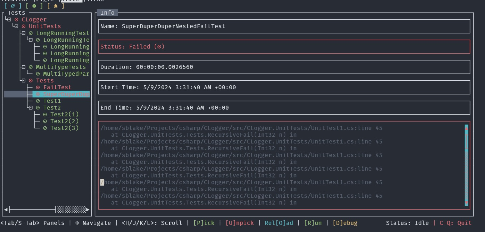
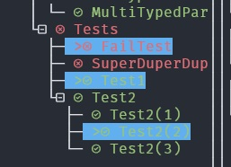

# CLogger



Clogger is a TUI based `dotnet test` explorer, runner, and debug hook for those of us dotnet devs that like to live in the CLI land.

Features include:
* Automatic Test Discovery
* Pick and choose tests to run/debug
* Process Id hook for debug mode

## Installing

To start you will need to install the clogger dotnet tool globally:
```
dotnet tool install --global CLogger.Tui
```

This will enable the `clogger` CLI globally.

Next you need to add the clogger test adapter nuget package to your test project(s)
```
dotnet add package clogger.testlogger
```

You should now be able to `cd` to either your `.sln` directory, or, the directory that has your `.csproj` for your test project, and invoke
```
clogger
```
And it should start up and load tests

## Keymaps

**Change panels**: Use `Tab` / `Shift-Tab` to switch focused panels within the UI

**Navigate within a panel**: Use the arrow keys `←↑→↓` to switch selected items inside of a panel

**Expand/Collapse Treeview**: Use the Left and Right arrow keys `←/→` to Expand and Collapse nodes of the test tree respectively

**Scrolling**: `H/L` are used for scroll left/right, and `J/K` for scrolling down/up, respectively. Primarily used for the Treeview and the Error StackTrace panels.

**Quit**: `Ctrl-Q`

**Pick/Unpick Test(s)**: P and U will Pick and Unpick tests respectively, which will be marked via the `>` symbol and highlighting when picked. See **Run Tests** and **Debug Tests** for more info about picking tests.



**Reload Test List**: `O`, wipes the current tree of discovered tests and re-runs discovery from scratch.

**Run Tests**: Runs all tests if none are picked, otherwise, will queue up all picked tests to be run.

**Debug Tests**: Works the same as **Run Tests**, but sets `VSTEST_HOST_DEBUG` to `1`, which prompts the Test Runner to wait for a debugger to attach to an exposed ProcessId. When this ProcessId is logged a dialog will appear inside of CLogger that you can copy and use for attaching your debugger of choice to. Will only queue picked tests if any are picked, otherwise will queue all tests for debugging.

**Cancel Current Test Run**: `C`, hard stops current test process. All "in flight" tests will have their states tagged as "Cancelled"

## CLI Arguments

### --help
Displays help info for CLogger

### --run / -r
Starts up CLogger in run mode, skips discovery step and goes straight to running all tests (this will still populate them into the treeview as their results are recieved)

### --debug / -d
Starts up CLogger in debug mode, must be paired with the `--run` flag or it wont do anything at all (TODO: does this need to be improved?)

### --version
Prints CLoggers version info

### [arg0] (Path)
Additionally the PWD for `dotnet test` can be specified to be other than the current one by passing in a last non flag arg. Must point directly to a `.sln` or `.csproj` file, will not work for a directory on its own.

Example
```
clogger --run ../../somewhere/else/MyTestProject/MyTestProject.csproj
```
